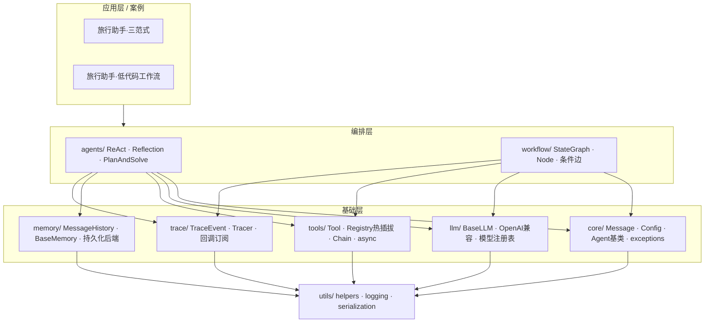

# 架构图（交付物 D2）

> 此处为架构图草稿（Mermaid 源），最终交付含 PNG。随各里程碑落地持续更新。

```mermaid
flowchart TB
    subgraph APP[应用层 / 案例]
        TA[旅行助手·三范式]
        WF[旅行助手·低代码工作流]
    end

    subgraph ORCH[编排层]
        AG[agents/ ReAct · Reflection · PlanAndSolve]
        GR[workflow/ StateGraph · Node · 条件边]
    end

    subgraph BASE[基础层]
        CORE[core/ Message · Config · Agent基类 · exceptions]
        LLM[llm/ BaseLLM · OpenAI兼容 · 模型注册表]
        TOOL[tools/ Tool · Registry热插拔 · Chain · async]
        MEM[memory/ MessageHistory · BaseMemory · 持久化后端]
        TRACE[trace/ TraceEvent · Tracer · 回调订阅]
    end

    UTILS[utils/ helpers · logging · serialization]

    APP --> ORCH
    AG --> CORE & LLM & TOOL & MEM & TRACE
    GR --> CORE & LLM & TOOL & TRACE
    CORE & LLM & TOOL & MEM & TRACE --> UTILS
```
